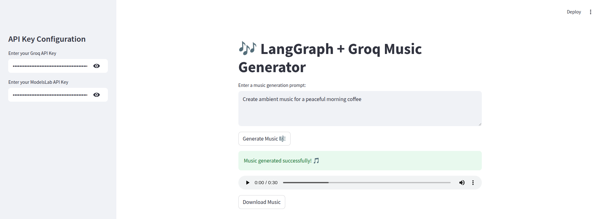

ModelsLab Music Generator (Groq + LangGraph Version)
This is a Streamlit-based AI music generator app that uses the Groq LLM (LLaMA3) with the ModelsLab API. It allows users to input a prompt describing the kind of music they want, and generates downloadable MP3 tracks.

# 🎶 AI Music Generator (Groq + LangGraph + ModelsLab)

This project is an **AI-powered music generation app** built using:
- [Groq LLMs](https://groq.com/)
- [LangGraph](https://github.com/langchain-ai/langgraph)
- [ModelsLab API](https://models-lab.com/)
- Streamlit for the user interface

Users can enter a prompt like _"Generate a 30-second lo-fi chill beat"_ and instantly get a downloadable `.mp3` file.

---

## 🚀 Features

- ⚡ Powered by ultra-fast Groq LLM (`llama3-70b-8192`)
- 🎼 Uses `ModelsLabTools` to generate actual music in MP3
- 🧠 Modular agent orchestration using `LangGraph`
- 🎧 Stream & download music directly in your browser

---

## 🧩 Tech Stack

| Component   | Technology             |
|-------------|------------------------|
| LLM Agent   | Groq + agno.agent      |
| Music Gen   | ModelsLabTools         |
| Workflow    | LangGraph              |
| UI          | Streamlit              |
| HTTP        | requests                |

---

## 🔑 API Keys Required

1. **Groq API Key**  
   Get yours here: [https://console.groq.com/keys](https://console.groq.com/keys)

2. **ModelsLab API Key**  
   Sign up at [https://models-lab.com/](https://models-lab.com/)

Paste both keys in the sidebar when running the app.

---

## 🛠 Installation

```bash
# 1. Clone the repo
git clone https://github.com/your-username/ai-music-generator
cd ai-music-generator

# 2. Install dependencies
pip install -r requirements.txt

Running the App
streamlit run music_generator_agent.py

Output
All generated music files will be saved under:
audio_generations

!## 📸 Screenshot

Here is how the app looks:

